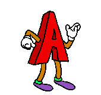

<!-- "Hero" Header -->

  
   
  <table align="center">
    <tr>
      <td style="padding: 0 !important;">
        
      </td>
      <td style="padding: 0 !important;">
        
      </td>
      <td style="padding: 0 !important;">
        
      </td>
    </tr>
  </table>
   
  <table>
    <tr>
      <td style="padding: 0 !important;">
        
      </td>
      <td style="padding: 0 !important;">
        
      </td>
      <td style="padding: 0 !important;">
        
      </td>
      <td style="padding: 0 !important;">
        
      </td>
    </tr>
  </table>
   
  <table>
    <tr>
      <td style="padding: 0 !important;">
        
      </td>
      <td style="padding: 0 !important;">
        
      </td>
      <td style="padding: 0 !important;">
        
      </td>
      <td style="padding: 0 !important;">
        
      </td>
      <td style="padding: 0 !important;">
        
      </td>
      <td style="padding: 0 !important;">
        
      </td>
      <td style="padding: 0 !important;">
        
      </td>
    </tr>
  </table>

 

<!-- Social -->
<table width="100%" align="center">
<tr>
<td align="center">
<a href="https://www.npmjs.com/package/7.css-vue">
<strong>Visit my Vue 3 library</strong>

 
 

</a>

</td>

<td align="center">
<a href="https://www.youtube.com/watch?v=E20G25SCAEg">
<strong>Some mexican music 😃</strong>

 
 

</a>

</td>

<td align="center">
<a href="https://www.youtube.com/watch?v=yhSq6AYSCKw">
<strong>Frutiger Aero Music</strong>

 
 

</a>

</td>
</tr>
</table>

 

<!-- "margin-right: whatever;" -->
&nbsp;&nbsp;&nbsp;&nbsp;  

&nbsp;&nbsp;&nbsp;&nbsp;  

